Bellabeat Case Study
================
Samiya West
2023-08-22

- [1 Introduction](#introduction)
  - [1.1 Data](#data)
  - [1.2 Data Cleaning](#data-cleaning)
- [2 Visualize and Analyze](#visualize-and-analyze)
  - [2.1 Daily Steps and Calories](#daily-steps-and-calories)
  - [2.2 Sedentary Minutes and Total Minutes
    Asleep](#sedentary-minutes-and-total-minutes-asleep)
  - [2.3 Average Minutes of Sleep per
    Day](#average-minutes-of-sleep-per-day)
  - [2.4 Average Steps and Active Minutes per
    Day](#average-steps-and-active-minutes-per-day)
  - [2.5 Average Total Intensities per
    Hour](#average-total-intensities-per-hour)
- [3 Conclusion](#conclusion)

# 1 Introduction

**Background**: The Bellabeat app provides users with health data
related to their activity, sleep, stress, menstrual cycle, and
mindfulness habits. This data can help users better understand their
current habits and make healthy decisions.

**Business Task**: Conduct an analysis of data from the FitBit Fitness
Tracker and extract valuable insights to steer marketing strategies for
Bellabeat.

## 1.1 Data

**This data set generated by respondents to a distributed survey via
Amazon Mechanical Turk between 03.12.2016-05.12.2016. Thirty eligible
Fitbit users consented to the submission of personal tracker data,
including minute-level output for physical activity, heart rate, and
sleep monitoring.**

Upon importing the data into Excel for a preliminary review, I
discovered that certain tables had already been combined with the Daily
Activity table. However, the data associated with participants’ daily
sleep, weight logs, and hourly intensities had not been integrated into
the daily activity table. The four primary tables I will be dealing with
are Daily Activity, Sleep Day, Weight Log, and Hourly Intensities.

``` r
activity = read.csv("Fitbase_Data/dailyActivity_merged.csv")
sleep = read.csv("Fitbase_Data/sleepDay_merged.csv")
weight = read.csv("Fitbase_Data/weightLogInfo_merged.csv")
intensities = read.csv("Fitbase_Data/hourlyIntensities_merged.csv")
str(activity)
```

    ## 'data.frame':    940 obs. of  15 variables:
    ##  $ Id                      : num  1.5e+09 1.5e+09 1.5e+09 1.5e+09 1.5e+09 ...
    ##  $ ActivityDate            : chr  "4/12/2016" "4/13/2016" "4/14/2016" "4/15/2016" ...
    ##  $ TotalSteps              : int  13162 10735 10460 9762 12669 9705 13019 15506 10544 9819 ...
    ##  $ TotalDistance           : num  8.5 6.97 6.74 6.28 8.16 ...
    ##  $ TrackerDistance         : num  8.5 6.97 6.74 6.28 8.16 ...
    ##  $ LoggedActivitiesDistance: num  0 0 0 0 0 0 0 0 0 0 ...
    ##  $ VeryActiveDistance      : num  1.88 1.57 2.44 2.14 2.71 ...
    ##  $ ModeratelyActiveDistance: num  0.55 0.69 0.4 1.26 0.41 ...
    ##  $ LightActiveDistance     : num  6.06 4.71 3.91 2.83 5.04 ...
    ##  $ SedentaryActiveDistance : num  0 0 0 0 0 0 0 0 0 0 ...
    ##  $ VeryActiveMinutes       : int  25 21 30 29 36 38 42 50 28 19 ...
    ##  $ FairlyActiveMinutes     : int  13 19 11 34 10 20 16 31 12 8 ...
    ##  $ LightlyActiveMinutes    : int  328 217 181 209 221 164 233 264 205 211 ...
    ##  $ SedentaryMinutes        : int  728 776 1218 726 773 539 1149 775 818 838 ...
    ##  $ Calories                : int  1985 1797 1776 1745 1863 1728 1921 2035 1786 1775 ...

``` r
str(sleep)
```

    ## 'data.frame':    413 obs. of  5 variables:
    ##  $ Id                : num  1.5e+09 1.5e+09 1.5e+09 1.5e+09 1.5e+09 ...
    ##  $ SleepDay          : chr  "4/12/2016 12:00:00 AM" "4/13/2016 12:00:00 AM" "4/15/2016 12:00:00 AM" "4/16/2016 12:00:00 AM" ...
    ##  $ TotalSleepRecords : int  1 2 1 2 1 1 1 1 1 1 ...
    ##  $ TotalMinutesAsleep: int  327 384 412 340 700 304 360 325 361 430 ...
    ##  $ TotalTimeInBed    : int  346 407 442 367 712 320 377 364 384 449 ...

``` r
str(weight)
```

    ## 'data.frame':    67 obs. of  8 variables:
    ##  $ Id            : num  1.50e+09 1.50e+09 1.93e+09 2.87e+09 2.87e+09 ...
    ##  $ Date          : chr  "5/2/2016 11:59:59 PM" "5/3/2016 11:59:59 PM" "4/13/2016 1:08:52 AM" "4/21/2016 11:59:59 PM" ...
    ##  $ WeightKg      : num  52.6 52.6 133.5 56.7 57.3 ...
    ##  $ WeightPounds  : num  116 116 294 125 126 ...
    ##  $ Fat           : int  22 NA NA NA NA 25 NA NA NA NA ...
    ##  $ BMI           : num  22.6 22.6 47.5 21.5 21.7 ...
    ##  $ IsManualReport: chr  "True" "True" "False" "True" ...
    ##  $ LogId         : num  1.46e+12 1.46e+12 1.46e+12 1.46e+12 1.46e+12 ...

``` r
str(intensities)
```

    ## 'data.frame':    22099 obs. of  4 variables:
    ##  $ Id              : num  1.5e+09 1.5e+09 1.5e+09 1.5e+09 1.5e+09 ...
    ##  $ ActivityHour    : chr  "4/12/2016 12:00:00 AM" "4/12/2016 1:00:00 AM" "4/12/2016 2:00:00 AM" "4/12/2016 3:00:00 AM" ...
    ##  $ TotalIntensity  : int  20 8 7 0 0 0 0 0 13 30 ...
    ##  $ AverageIntensity: num  0.333 0.133 0.117 0 0 ...

## 1.2 Data Cleaning

Variable conversions

``` r
activity$ActivityDate = as.Date(activity$ActivityDate,format = "%m/%d/%Y")
sleep$SleepDay = as.POSIXct(sleep$SleepDay, format = "%m/%d/%Y %H:%M:%S %p")
weight$Date = as.POSIXct(weight$Date, format = "%m/%d/%Y %H:%M:%S %p")
intensities$ActivityHour = parse_date_time(intensities$ActivityHour, "mdY IMS p")
weight$IsManualReport = as.logical(weight$IsManualReport)
```

Renaming columns

``` r
sleep = sleep %>%
  rename("Date" = "SleepDay")
activity = activity %>%
  rename("Date" = "ActivityDate")
intensities = intensities %>% 
  rename("Date" = "ActivityHour")
intensities$Time = format(intensities$Date, "%H:%M:%S")
```

Deletion

``` r
weight = subset(weight, select = -Fat)
activity$TrackerDistance[activity$TrackerDistance == 0] = NA
activity = activity %>%
  na.omit(TrackerDistance)
```

``` r
n_distinct(activity$Id)
```

    ## [1] 33

``` r
n_distinct(sleep$Id)
```

    ## [1] 24

``` r
n_distinct(weight$Id)
```

    ## [1] 8

``` r
n_distinct(intensities$Id)
```

    ## [1] 33

With the Weight Log Table the sample size is not large enough to make
accurate insights.

Creating New Tables

``` r
activity_join = merge(activity,sleep, by = c("Id","Date"))
```

``` r
activity_by_day = activity %>%
  group_by(Day = wday(Date , label = TRUE, week_start = 7)) %>%
   summarise(AvgCal = mean(Calories), AvgSteps = mean(TotalSteps), ActiveMins= mean(sum(VeryActiveMinutes,FairlyActiveMinutes,LightlyActiveMinutes)))
activity_by_id = activity %>%
  group_by(Id) %>%
   summarise(AvgCal = mean(Calories), AvgSteps = mean(TotalSteps), ActiveMins= mean(sum(VeryActiveMinutes,FairlyActiveMinutes,LightlyActiveMinutes)))
```

``` r
sleep_by_day = sleep %>%
  group_by(Day = wday(Date, label = TRUE, week_start = 7)) %>%
  summarise(AverageMinsOfSleep = mean(TotalMinutesAsleep))
sleep_by_id = sleep %>%
  group_by(Id)%>%
  summarise(AvgMinsAsleep = mean(TotalMinutesAsleep))
```

``` r
activity_join_byid = merge(activity_by_id, sleep_by_id, by = c("Id"))
```

``` r
intensities_hour = intensities %>%
  group_by(Time) %>%
  summarise(AvgTotIntensity = mean(TotalIntensity))
```

# 2 Visualize and Analyze

## 2.1 Daily Steps and Calories

``` r
lm_activity = lm(Calories ~ TotalSteps, data = activity)
res_calories = resid(lm_activity)
plot(lm_activity)
```

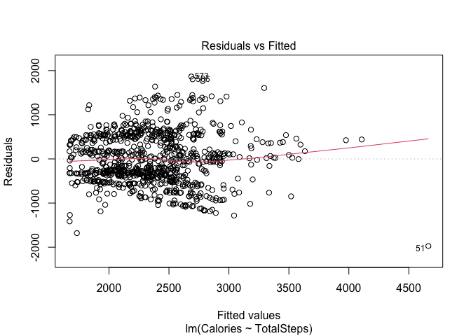<!-- -->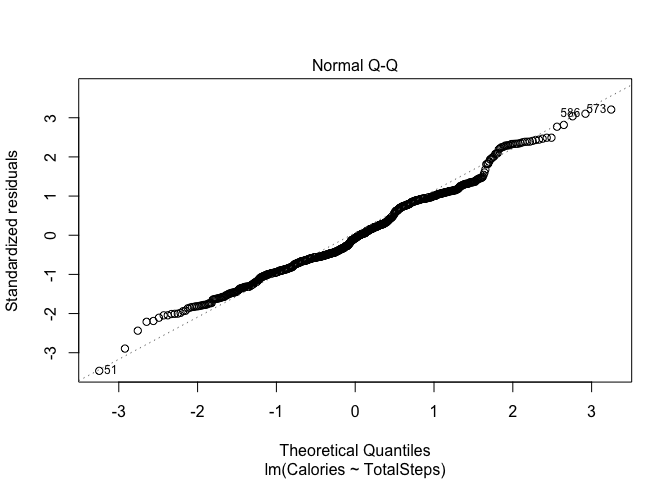<!-- -->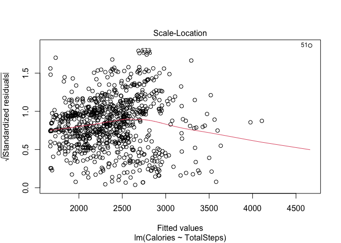<!-- -->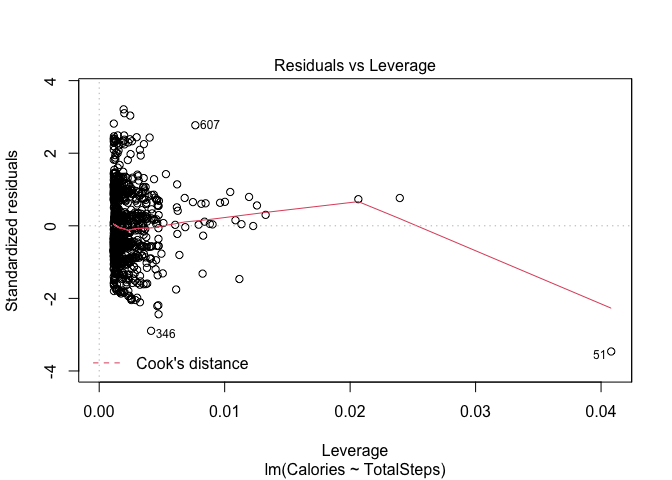<!-- -->

``` r
ggplot(data = activity, aes(x=TotalSteps, y = Calories)) + geom_point() + geom_smooth() + labs(title = "Daily Steps vs Calories")
```

    ## `geom_smooth()` using method = 'loess' and formula = 'y ~ x'

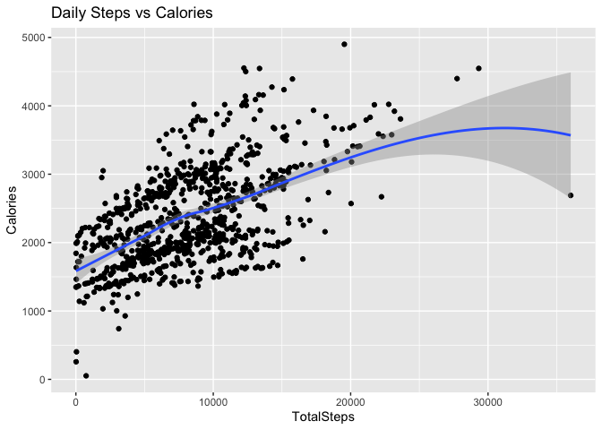<!-- -->

``` r
cor(activity$TotalSteps,activity$Calories)
```

    ## [1] 0.5607237

From the graphical representations and the calculated correlation value,
it is evident that a moderate positive correlation of 0.5607 exists
between Total Steps and Calories. This implies that there is a tendency
for users who take more steps to also burn more calories.

**Based on my findings users don’t need be extremely active, they can
just walk more. Bellabeat can encourage users to take a certain amount
of steps per day.**

## 2.2 Sedentary Minutes and Total Minutes Asleep

``` r
lm_sleep_active = lm(TotalMinutesAsleep ~ SedentaryMinutes, data = activity_join)
res_sleep = resid(lm_sleep_active)
```

``` r
qqnorm(res_sleep)
qqline(res_sleep)
```

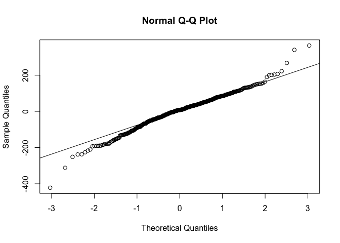<!-- -->

``` r
ggplot(data = activity_join, aes(x=SedentaryMinutes, y = TotalMinutesAsleep)) + geom_point() + geom_smooth() + labs(title = "Sedentary Active Minutes vs Total Minutes Asleep")
```

    ## `geom_smooth()` using method = 'loess' and formula = 'y ~ x'

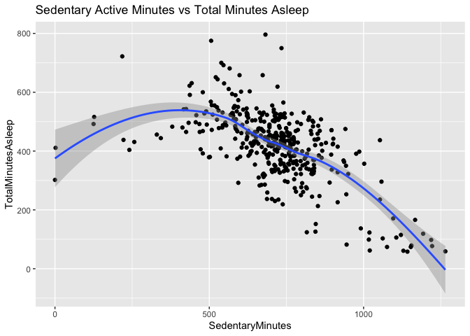<!-- -->

``` r
cor(activity_join$SedentaryMinutes, activity_join$TotalMinutesAsleep)
```

    ## [1] -0.599394

I observed a notable adverse correlation between Sedentary Active
Minutes and Total Minutes of Sleep. This suggests that when a user
spends more time awake, but inactive they tend to receive fewer minutes
of sleep. **To improve physical activeness with users Bellabeat can send
alerts to users notifying them about how much time they have been
inactive.**

## 2.3 Average Minutes of Sleep per Day

``` r
ggplot(data = sleep_by_day, aes(x = Day, y = AverageMinsOfSleep)) + geom_col(fill = "purple") + labs(title = "Average Minutes of Sleep per Day")
```

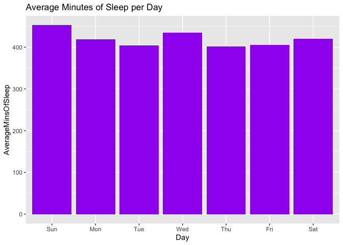<!-- -->

I discovered that Sunday has the highest amount of average sleep
minutes, while Thursday has the lowest. **Bellabeat can include a
bedtime portion where users are notified when their bedtime is
approaching and automatically sets alarms to wake them up.**

## 2.4 Average Steps and Active Minutes per Day

``` r
ggplot(data = activity_by_day, aes(x = Day, y = AvgSteps)) + geom_col(fill = "orange") + labs(title = "Average Amount of Steps per Day")
```

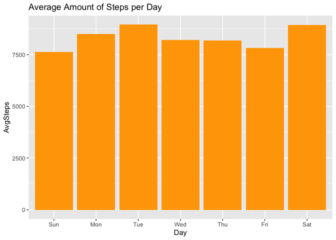<!-- -->

``` r
ggplot(data = activity_by_day, aes(x = Day, y = ActiveMins)) + geom_col(fill = "blue") + labs(title = "Average Minutes of Activity per Day")
```

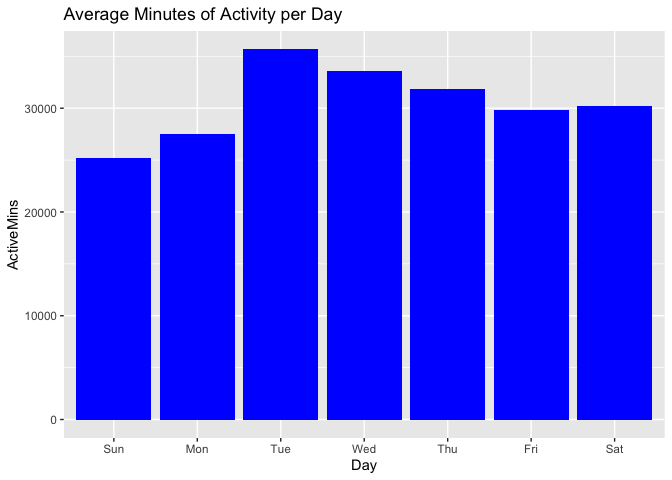<!-- -->

To compute the average total activity minutes, I obtained the mean of
Lightly, Fairly, and Very active minutes. Subsequently, I found that
Tuesday and Saturday exhibit the highest average daily step counts.
Additionally, I determined that Tuesday and Wednesday record the highest
average activity minutes, whereas Sunday and Monday demonstrate the
lowest levels of activity. **Bellabeat can use this to help motivate
users. Such as weekly challenges to help users be more active on the
less active days.**

## 2.5 Average Total Intensities per Hour

``` r
ggplot(data = intensities_hour, aes(x=Time, y = AvgTotIntensity)) + geom_histogram(stat = "identity", fill = "brown") + theme(axis.text.x = element_text(angle = 90)) + labs(title = "Average Total Intensity vs Hours")
```

    ## Warning in geom_histogram(stat = "identity", fill = "brown"): Ignoring unknown
    ## parameters: `binwidth`, `bins`, and `pad`

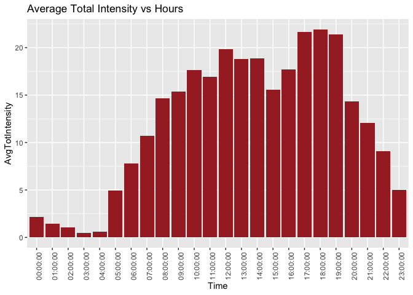<!-- -->

I discovered that the time slots of 5pm, 6pm, and 7pm exhibit the
highest average Total Intensity levels. This implies that individuals
are most active after finishing their work day. Additionally, I observed
that the time slots of 12pm, 1pm, and 2pm have the next highest average
Total Intensity levels, suggesting that people become active during
their lunch breaks. **Bellabeat can use this data to remind users to be
active during these peak times.**

# 3 Conclusion

Upon becoming acquainted with the dataset and subsequently undertaking
tasks involving data cleaning, processing, and analysis, I have
uncovered insights facilitated by both visual representations and
statistical tests. Bellabeat’s target demographic comprises women
engaged in full-time employment, who are concurrently striving to uphold
an active routine for the sake of a health-conscious way of life. For
the sake of precision, I operated under the assumption that the FitBit
data exclusively pertains to women.

**Marketing Strategy Recommendations for Bellabeat:**

\*Implementing prompts for users to engage in activity through
initiatives like daily step challenges or weekly activity challenges.

\*Sending notifications to users to inform them about periods of
inactivity, thereby raising awareness about sedentary active minutes.

\*Enhancing the sleep tracker functionality by allowing users to input
their own bedtime routines and offering suggestions based on their sleep
data.

\*Providing workout recommendations and suggesting adjusted bedtime
routines for users experiencing insufficient rest.

\*Sending notifications that display users’ most active times each day.

\*Issuing reminders for physical activity based on users’ most active
times, facilitating the cultivation of healthy routines.

\*In the mindfulness section of the app, Bellabeat could propose ideas
for low-calorie meals and snacks. Aligning with the CDC’s advice, this
could assist in achieving a calorie deficit for weight loss.

\*Given that the Bellabeat app already monitors stress, acknowledging
the negative impact stress causes with sleep quality and contribute to
weight gain, as indicated by Health.gov, the app can proactively advise
users to adopt stress management strategies when they are experiencing
such negative impacts.
